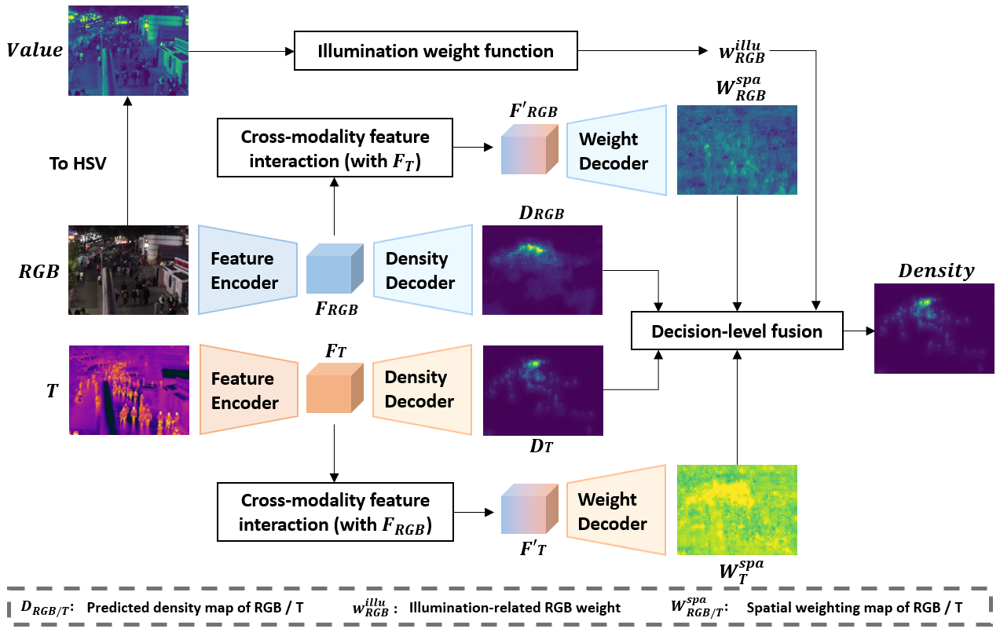
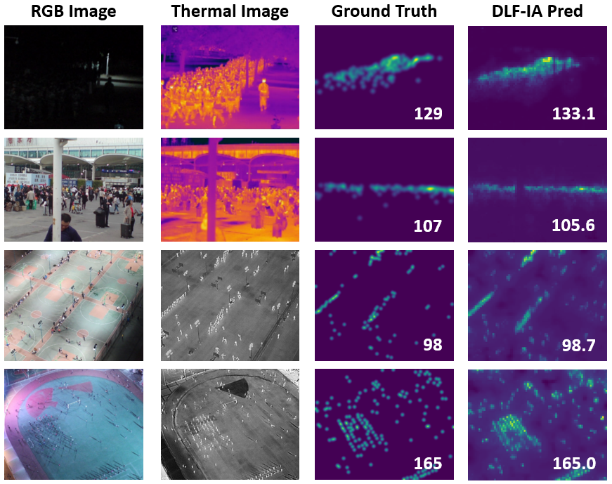

# DLF-IA

This repository includes the official implementation of DLF-IA for RGB-Thermal crowd counting, presented in our paper:

**[Late Better than Early: A Decision-Level Information Fusion Approach for RGB-Thermal Crowd Counting with Illumination Awareness](https://www.sciencedirect.com/science/article/pii/S0925231224006593)**

Neurocomputing, 2024

Jian Cheng, Chen Feng, Yang Xiao, Zhiguo Cao

Huazhong University of Science and Technology

### Overview
<p align="left">
  
</p>

### Visualization
<p align="left">
  
</p>

### Installation
The code has been tested on Python 3.9.7 and PyTorch 1.9.0. Please follow the official instructions to configure your environment. See other required packages in `requirements.txt`.

### Data Preparation
1. Download the datasets and unzip them under `./data/RGBTCrowdCounting/` and `./data/DroneRGBT/`. 

- RGBT-CC: https://github.com/chen-judge/RGBTCrowdCounting
- DroneRGBT: https://github.com/VisDrone/DroneRGBT

```
data:
├─── RGBTCrowdCounting
│   ├── train
│   ├── val
│   ├── test
│   ├── bright_list.json
│   └── dark_list.json
├─── DroneRGBT
│   ├── samples
│   ├── Train
│      ├── GT_
│      ├── Infrared
│      └── RGB
│   ├── Test
│      ├── GT_
│      ├── Infrared
│      └── RGB
```

2. Prepare the datasets. 

```
python preprocess_RGBTCC.py
python preprocess_DroneRGBT.py
```

After processing, the `data` folder should look like:

```
data:
├─── RGBTCrowdCounting
├─── DroneRGBT
├─── processedRGBTCC
│   ├── train
│   ├── val
│   ├── test
├─── processedDroneRGBT
│   ├── train
│   ├── val
```

3. Download the pretrained Swin-B model. 

```
wget https://github.com/SwinTransformer/storage/releases/download/v1.0.0/swin_base_patch4_window12_384_22k.pth
```

### Training
```
sh train.sh
```

### Testing
Download the pretrained models to the main folder. 

RGBTCC (GAME0: 10.00, RMSE: 18.12) [BaiduYun](https://pan.baidu.com/s/1-KvisY4PfpW_Uk6DzPw1AA) (code: k8fp) 

DroneRGBT (MAE: 6.19, MSE: 9.82) [BaiduYun](https://pan.baidu.com/s/1_m5ea0GRosB0nW9qRwDxdQ) (code: eabp) 

```
sh test.sh
```

### Permission
The code are only for non-commercial purposes. Copyrights reserved.

Contact: 
Jian Cheng (jian_cheng@hust.edu.cn) 
